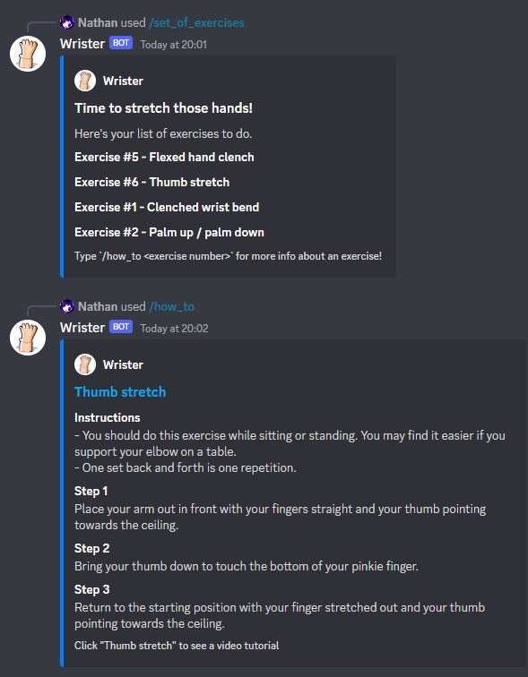

# Wrister
A Discord bot reminding you to exercise your wrists every day.  

## About
This is a Discord bot which sends a randomized set of hand, finger and wrist exercises at specific times throughout
the day.  

Exercises are taken from [this article](https://www.nhsinform.scot/illnesses-and-conditions/muscle-bone-and-joints/exercises/exercises-for-wrist-hand-and-finger-problems)
from NHS inform, a branch of the Scottish National Health Service.

## Setup  
- Run `pip install -r requirements.txt` - creating a fresh virtualenv is recommended
- Copy the .env example and add your bot's token

## Licensing
This project is free and open-source under the MIT License